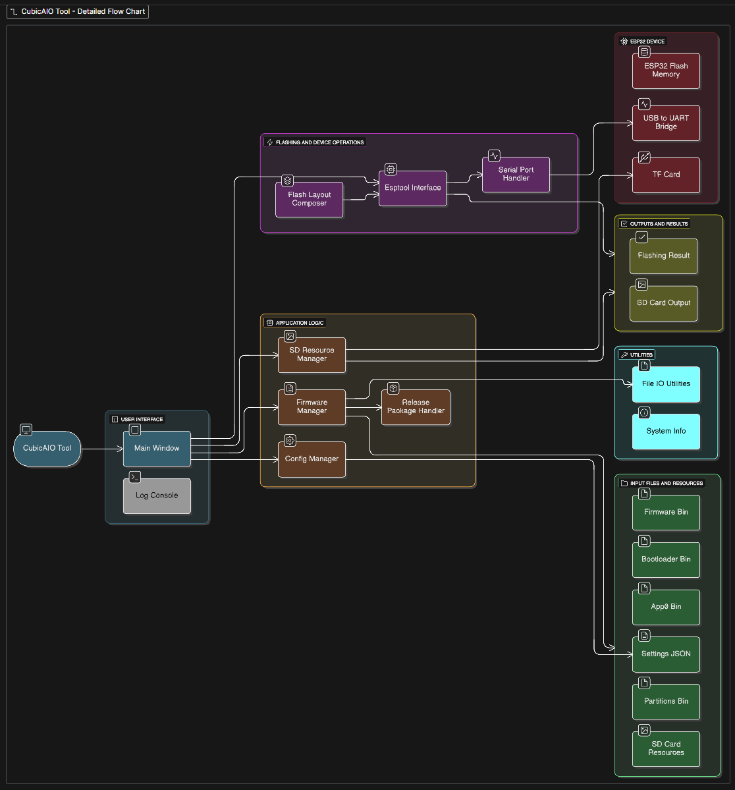

# AIO Tool - PC Companion Software for HoloCubic AIO Firmware

[中文文档](README_zh-CN.md) | English

HoloCubic_AIO Open Source Repository: https://github.com/ClimbSnail/HoloCubic_AIO

[^_^]:
	


## Architecture

### AIO Tool Flowchart



The flowchart above illustrates the architecture and data flow of the AIO Tool application, showing how different modules interact with each other.

## Quick Start

### Prerequisites
- [uv](https://github.com/astral-sh/uv) - Fast Python package manager (recommended)

### One-Click Installation (Recommended)

Use the automated script to quickly set up the environment:

```bash
# Windows PowerShell
.\setup.ps1
```

### Manual Installation

#### Method 1: Using uv (Recommended)

```bash
# 1. Install uv (if not already installed)
# Windows (PowerShell)
powershell -c "irm https://astral.sh/uv/install.ps1 | iex"

# macOS/Linux
curl -LsSf https://astral.sh/uv/install.sh | sh

# 2. Create virtual environment
uv venv

# 3. Install all dependencies (including local esptool)
uv pip install -r requirements.txt

# 4. Run the application
uv run python CubicAIO_Tool.py
```

#### Method 2: Traditional Approach

```bash
# 1. Create virtual environment
python -m venv venv

# 2. Activate virtual environment
# Windows
venv\Scripts\activate
# macOS/Linux
source venv/bin/activate

# 3. Install all dependencies (including local esptool)
pip install -r requirements.txt

# 4. Run the application
python CubicAIO_Tool.py
```

### Dependencies

The `requirements.txt` includes:
- **Runtime dependencies**: pillow, requests, pyserial
- **esptool v4.1**: Installed from local `esptool_v41/` directory
- **Build tools**: pyinstaller (for packaging executable)

All esptool dependencies (bitstring, cryptography, ecdsa, reedsolo) will be installed automatically.

## Important Note
This project contains all PC software code and resource files, but is missing the video conversion tool `ffmpeg` (file too large). If you need video conversion functionality, you can download it from the official `ffmpeg` repository at https://github.com/FFmpeg/FFmpeg and place the `ffmpeg.exe` file in the project root directory.

Or install using a package manager (recommended):
```bash
# Windows (Chocolatey)
choco install ffmpeg -y

# macOS (Homebrew)
brew install ffmpeg

# Linux (Ubuntu/Debian)
sudo apt install ffmpeg
```

## Building Executable

### Using spec File (Recommended)

This project includes an optimized `CubicAIO_Tool.spec` file that correctly packages all dependencies (including esptool):

```bash
# Using uv (recommended)
uv run pyinstaller CubicAIO_Tool.spec

# Or clean rebuild
uv run pyinstaller --clean CubicAIO_Tool.spec
```

### Quick Build (Not Recommended)

```bash
# Using uv
uv run pyinstaller --icon ./image/holo_256.ico -w -F CubicAIO_Tool.py

# Traditional way
pyinstaller --icon ./image/holo_256.ico -w -F CubicAIO_Tool.py
```

**⚠️ Note**: Quick build may not correctly include the esptool module. It's recommended to use the `.spec` file.

**Parameter Description:**
- `--icon ./image/holo_256.ico` - Set application icon
- `-w` - Hide console window (GUI only)
- `-F` - Package into a single executable file

**Output Location:** `dist/CubicAIO_Tool.exe`

## Troubleshooting

### "No module named 'esptool'" Error

If you encounter this error:

1. **Check if esptool is installed**:
   ```bash
   uv pip list | findstr esptool  # Windows
   uv pip list | grep esptool     # macOS/Linux
   ```

2. **Reinstall all dependencies**:
   ```bash
   uv pip install --force-reinstall -r requirements.txt
   ```

3. **Rebuild the executable**:
   ```bash
   uv run pyinstaller --clean CubicAIO_Tool.spec
   ```

### Other Common Issues

- **Virtual environment activation failed**: Ensure you're using the correct activation command (see installation instructions above)
- **Dependency installation failed**: Try upgrading pip/uv to the latest version
- **Build failed**: Ensure all dependencies are correctly installed

## Developer Notes

### About Flashing
After developing for ESP32, flashing requires extracting four files: two boot loader files `bootloader_qio_80m.bin` and `boot_app0.bin`, one flash partition file `partitions.bin`, and one firmware file `firmware.bin` (named `HoloCubic_AIO固件_vX.X.X.bin` in this project). https://github.com/ClimbSnail/HoloCubic_AIO/releases/tag/v2.1.0%E5%9B%BA%E4%BB%B6


###### File Locations and Flash Addresses (Windows example):
1. `bootloader_qio_80m.bin` is located in `.platformio\packages\framework-arduinoespressif32\tools\sdk\bin` under the PlatformIO installation directory, with flash address 0x1000.
2. `boot_app0.bin` is located in `platformio\packages\framework-arduinoespressif32\tools\partitions` under the PlatformIO installation directory, with flash address 0xe000.
3. `partitions.bin` is located in `.pioenvs\[board]` under the code project directory, with flash address 0x8000. The `partitions.csv` in `platformio\packages\framework-arduinoespressif32\tools\partitions` is the partition configuration file that varies with board selection. It can be edited in Excel and recompiled using PIO. It can also be compiled and decompiled using the `gen_esp32part.py` script: `python C:\SPB_Data\.platformio\packages\framework-arduinoespressif32\tools\gen_esp32part.py --verify xxx.csv xxx.bin` (converting csv to bin, or vice versa by swapping positions).
4. `firmware.bin` is located in `.pioenvs\[board]` under the code project directory. This is the compiled firmware with flash address 0x10000. If the partition file hasn't been modified, only this file needs to be flashed at the corresponding address for firmware updates. This file is manually named `HoloCubic_AIO固件_vX.X.X.bin` and is frequently updated with source code changes.

### Flash Reference Script
1. `python tool-esptoolpy\esptool.py --port COM7 --baud 921600 write_flash -fm dio -fs 4MB 0x1000 bootloader_qio_80m.bin 0x00008000 partitions.bin 0x0000e000 boot_app0.bin 0x00010000 HoloCubic_AIO固件_v1.3.bin`
2. Erase flash command: `python tool-esptoolpy\esptool.py erase_flash`

Available baud rates:
* 115200
* 230400
* 460800
* 576000
* 921600
* 1152000


### Image Conversion Key Points
https://lvgl.io/assets/images/logo_lvgl.png

Using LVGL's official converter https://lvgl.io/tools/imageconverter, images can be converted to (True color with alpha, select Binary RGB565) bin files for storage on SD card.

## Project Structure

```
AIO_Tool/
├── CubicAIO_Tool.py          # Main program entry
├── CubicAIO_Tool.spec         # PyInstaller config file (includes esptool config)
├── requirements.txt           # Python dependencies (including local esptool)
├── setup.ps1                  # Windows automated installation script
├── esptool_v41/              # Local esptool v4.1 package
├── page/                      # UI page modules
│   ├── download_debug.py     # Download debug page (uses esptool)
│   ├── videotool.py          # Video tool
│   ├── images_converter.py   # Image converter
│   └── ...
├── util/                      # Utility modules
├── image/                     # Icon resources
├── base_bin/                  # Base firmware files
└── dist/                      # Build output directory
    └── CubicAIO_Tool.exe     # Final executable
```

## Acknowledgments
* Firmware download tool: https://github.com/espressif/esptool
* Video transcoding tool: https://github.com/FFmpeg/FFmpeg
* LVGL offline conversion tool: https://github.com/W-Mai/lvgl_image_converter

