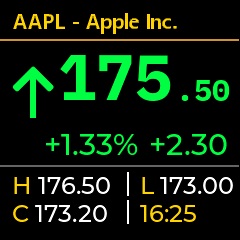
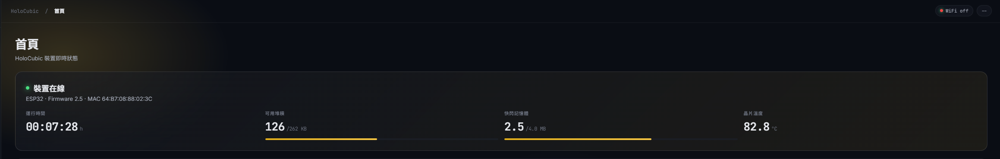
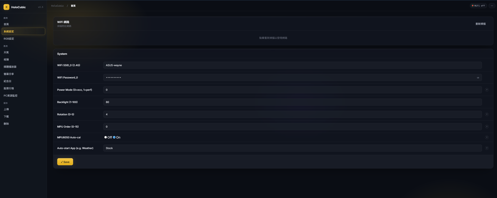
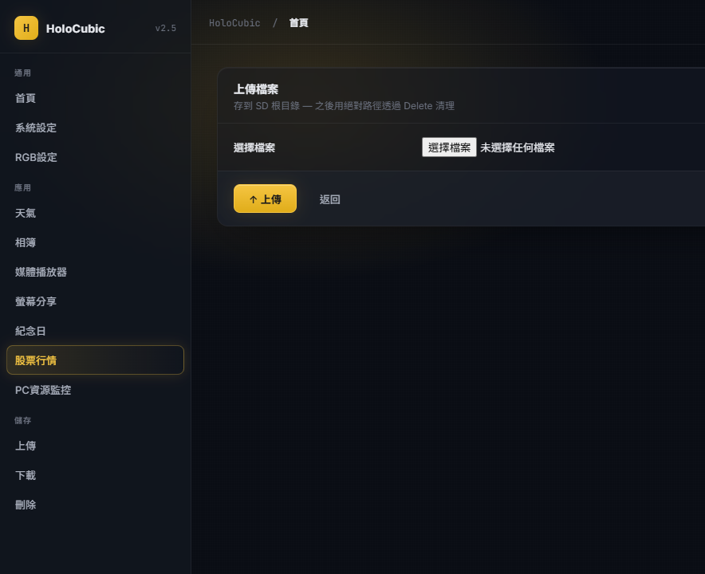
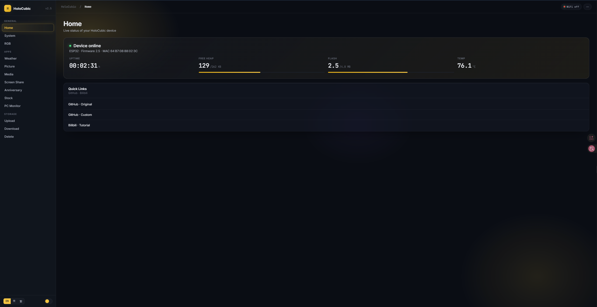
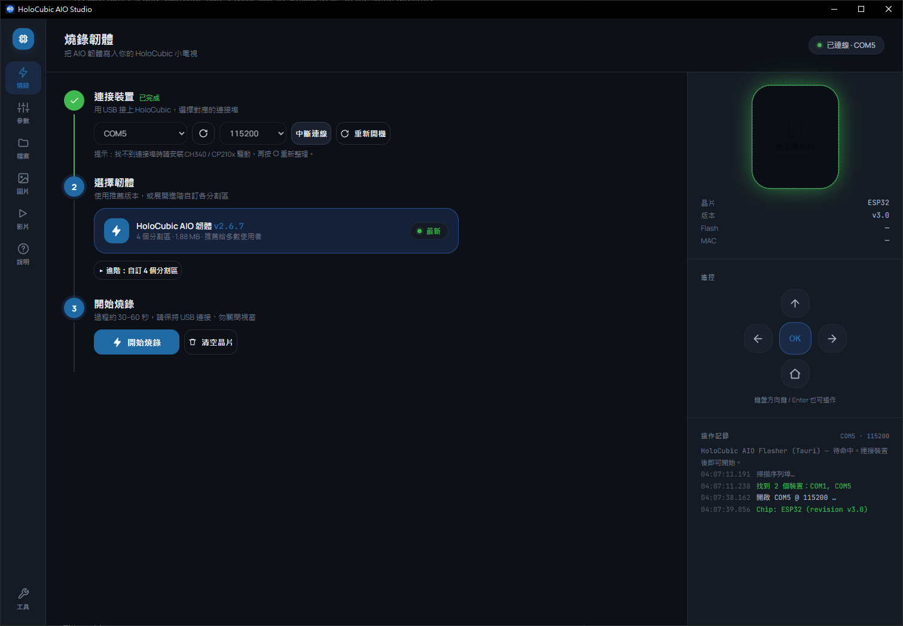
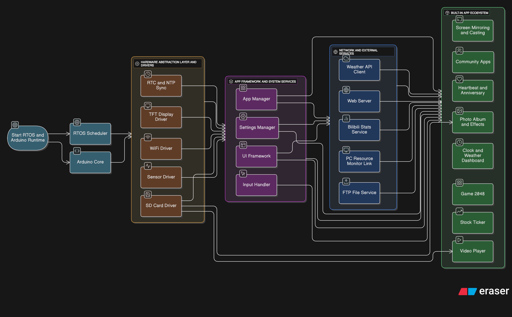

# HoloCubic-AIO-Enhanced (All in one for HoloCubic)

> 🌍 _您也可以阅读本文件的其他语言版本 [简体中文 Simplified Chinese](./README_zh-CN.md)_




## 📖 Project Introduction

`Holocubic` was originally an open-source project by [稚晖君](https://github.com/peng-zhihui), and this project is a third-party independent firmware running on HoloCubic hardware.

**AIO** stands for **All in One**, aiming to integrate as many features as possible into the Holocubic firmware while keeping it open-source. The firmware currently contains `20,000+` lines of code, with the host software at `4,000` lines (excluding font libraries and images). We invite everyone to join in developing the AIO firmware, host software, and peripherals to meet more users' needs.

This firmware is fully open-source for learning and experimentation. If you use this project for secondary development or partial reference, please provide appropriate attribution.

### 🔗 Project Links

* **Original project**: https://github.com/peng-zhihui/HoloCubic
* **Original AIO project**: https://github.com/ClimbSnail/HoloCubic_AIO
* **This project (Latest)**: https://github.com/asdfghj1237890/HoloCubic-AIO-Enhanced

---

## 👥 Development Team

* **AIO Framework & Core Apps**: [ClimbSnail](https://github.com/ClimbSnail), [asdfghj1237890](https://github.com/asdfghj1237890)
* **2048 Game**: [AndyXFuture](https://github.com/AndyXFuture)
* **New Weather Clock**: [PuYuuu](https://github.com/PuYuuu), [asdfghj1237890](https://github.com/asdfghj1237890)
* **BiliBili Fans App**: [cnzxo](https://github.com/cnzxo/)
* **Anniversary & Heartbeat Apps**: [WoodwindHu](https://github.com/WoodwindHu), [asdfghj1237890](https://github.com/asdfghj1237890)
* **PC Resource Monitor**: [Jumping99](https://github.com/Jumping99)
* **Multi-function Animation**: [LHYHHD](https://github.com/LHYHHD)
* **Stock App**: [redwolf](https://github.com/redwolf), [asdfghj1237890](https://github.com/asdfghj1237890)
* More developers joining...

---

## ✨ Key Features

1. **Rich APP Ecosystem**: Built-in weather, clock, photo album, special effects, video player, PC screen sharing, web settings, and more
2. **Flexible Hardware**: Boot normally regardless of TF card insertion, MPU6050 soldering status, or WiFi connection (requires 2.4G WiFi)
3. **Modular Design**: Low-coupling architecture for easy extensibility
4. **Web Configuration**: Configure network and settings via web interface (see APP Introduction for details)
5. **Multiple Access Methods**: Access via IP address or domain name (http://holocubic) - some browsers may have limited support
6. **Remote File Management**: Upload/delete files on SD card via web interface without physical access
7. **Complete PC Tools**: Full host software suite with open-source code: https://github.com/asdfghj1237890/HoloCubic_AIO/tree/v2.0.2/AIO_Tool

## 🧭 Current Baseline & Recent Changes (2026-06)

- **Firmware baseline**: pioarduino `platform-espressif32 55.03.39`, Arduino-ESP32 `3.3.9`, ESP-IDF `5.5.4`, LVGL `9.5.0`, ArduinoJson `7.4.3`.
- **LVGL 9 migration**: firmware and SDL scenario harness now build against LVGL 9.5, with compatibility shims for legacy app code and refreshed golden screenshots.
- **ArduinoJson 7 migration**: firmware JSON code now uses v7 idioms (`JsonDocument`, fallback operator) and host-side parser tests.
- **ESP32 core 3.x hardening**: RGB task startup, LVGL boot tick, stock config parsing, and 2048 input/rendering regressions were fixed during the core/toolchain upgrade.
- **Stock app UI**: long company names are clamped to a single header line with UTF-8-safe ellipsis so they do not overlap the price UI.
- **Web settings**: the Glass UI now includes responsive breakpoints for phone/tablet widths instead of desktop-only layout assumptions.
- **Hardware smoke**: recent firmware was flashed on ESP32-PICO-D4 via CH9102/COM5 and observed booting through `AIO (All in one) version 3.3.2`, `Initialization MPU6050 success.`, and repeated Stock/Yahoo refreshes without a reset loop.

### 📺 Demo

**Video Tutorial**: https://www.bilibili.com/video/BV1wS4y1R7YF/

### 🎨 Web UI (Glass redesign)

The web configuration interface was rebuilt around a "Glass" design language — frosted panels, dark navy backdrop, full i18n (English / 简体中文 / 繁體中文), live device-stats hero, and per-field tooltips on the configuration forms. Pages match in look-and-feel across the **Home dashboard**, **Settings forms**, **File upload / download / delete**, and the **WiFi-scan card** on the System page. The latest responsive pass adds mobile breakpoints for narrow phone screens and medium tablet widths, so the settings pages no longer overflow horizontally on small browsers.

| Home (live KPIs) | Settings form (i18n + tooltips) |
|---|---|
|  |  |

| File upload page | Whole web view |
|---|---|
|  |  |

<details>
<summary>📸 Hardware shots</summary>


</details>

---


## 🔧 Firmware Flashing (No IDE Required)

Download the PC tool from the release page to flash the firmware.

### Required Files

1. `bootloader.bin` - Bootloader
2. `partitions.bin` - Partition file
3. `boot_app0.bin` - Boot app
4. `HoloCubic_AIO_XXX.bin` - Latest firmware (updated with each version)

> **Note**: Files 1-3 remain stable across updates. Only the firmware file (`HoloCubic_AIO_XXX.bin`) changes with each version.

### Flashing Steps

1. Place files 1-3 and `CubicAIO_Tool-*-x86_64-windows-setup.exe` in the same directory
2. Run `CubicAIO_Tool-*-x86_64-windows-setup.exe`
3. Select the latest firmware `HoloCubic_AIO_XXX.bin`
4. Flash the firmware

**Video Tutorial**: https://b23.tv/5e6uDh

### 🛠️ AIO Tool (PC flasher + remote control)

The Windows desktop tool flashes firmware/bootloader/partitions in one shot, opens the device serial port for live debug logging, and (since v2.6.3) sends directional commands to the cube without needing to physically tilt it — useful for testing, demos, and developers without an MPU6050. Five buttons map 1:1 to the firmware's IMU action enum:

- ↑ → `UP`  · ← → `TURN_LEFT`  · → → `TURN_RIGHT`  · ✓ → `GO_FORWORD` (select / refresh)  · 🏠 → `RETURN` (back to launcher)



---

## 📚 Troubleshooting Guide

Having issues with hardware assembly or soldering? Check out our comprehensive troubleshooting guide:

**[🔧 HoloCubic Troubleshooting Guide v2.4](./HoloCubic_Troubleshooting_Guide_v2.4.md)**

This guide covers:
- Hardware versions and compatibility
- PCB fabrication and soldering
- Common issues and solutions
- Component selection and vendors
- Multimeter usage and testing procedures

---

## 🚀 Getting Started

### ⚠️ Power-On Important Notes

The device uses an MPU6050 gyroscope/accelerometer. For proper initialization:

1. **Keep the device stationary** for the first 3 seconds after power-on (don't hold it)
2. Wait for sensor initialization to complete - the RGB LED will fully light up
3. After initialization, normal operation can begin

> **Troubleshooting**: If the MPU6050 soldering is faulty, the orientation reading will be erratic (symptom: apps constantly switching). TF card insertion does not affect boot.

### 🎮 Operation Guide

#### TF Card Setup
- **File System**: FAT32
- **Required for**: Photo album, video playback
- **Setup**: Copy all files and folders from the `放置到内存卡` directory to the TF card root before first use
- **Note**: Device boots normally with or without TF card, but some APP functions require it

#### Gesture Controls
| Gesture | Duration | Action |
|---------|----------|--------|
| Shake left/right | 0.5s | Switch between APPs |
| Tilt forward | 1s | Enter current APP |
| Tilt backward | 1s | Exit current APP |

---

## 📱 APP Introduction

<details>
<summary><b>🌐 Web Server (网页配置服务)</b></summary>


- **Requirements**: None (WiFi info stored in flash, independent of TF card)
- **Access**: 
  - Device creates AP `HoloCubic_AIO` (no password) at `192.168.4.2`
  - Or use domain: http://holocubic
  - Recommended: Use IP address for better compatibility
- **Features**:
  - System parameter configuration
  - Weather APP settings
  - Photo album parameters
  - Player settings
  - Auto-start APP configuration
  - Responsive phone/tablet layout for the Glass UI
- **Developer**: ClimbSnail, asdfghj1237890

**First-time setup**: Connect PC to HoloCubic's WiFi hotspot, then configure via web interface.

</details>

<details>
<summary><b>📁 File Manager (文件管理器)</b></summary>

**Purpose**: Manage TF card files wirelessly

- **Requirements**: 
  - WiFi configured
  - TF card inserted
  - Sufficient USB power supply
- **Usage**: Enter via Windows File Explorer: `ftp://holocubic:aio@[YOUR_IP]`
  - Replace `[YOUR_IP]` with the IP shown on device screen

> ⚠️ **Note**: Some features still under development

</details>

<details>
<summary><b>🖼️ Picture Album (相册)</b></summary>

- **Requirements**: 
  - TF card with `image/` directory
  - Image files in `.jpg` or `.bin` format
- **Setup**:
  1. Convert images using PC tool (any resolution, auto-compressed)
  2. Save to `image/` directory
  3. Filename must be alphanumeric (cannot start with number)
- **Image Formats**:
  - Weather icons: C array (Indexed 16 colors)
  - Other images: Binary RGB565 `.bin` or `.jpg`
- **Settings**: Additional features configurable via WebServer

</details>

<details>
<summary><b>🎬 Video Player (Media)</b></summary>

- **Requirements**: TF card with `movie/` directory
- **Setup**:
  1. Convert videos (1:1 aspect ratio recommended) using conversion tool
  2. Save as `.mjpeg` or `.rgb` format in `movie/` directory
  3. Filename must be alphanumeric (cannot start with number)
- **Power Saving**:
  - Low-power mode after 90s idle
  - Secondary low-power mode after 120s (reduced frame rate)
- **Settings**: Additional features configurable via WebServer

</details>

<details>
<summary><b>🖥️ Screen Sharing (屏幕分享)</b></summary>

- **Requirements**: 
  - WiFi configured via Web Server
  - Sufficient USB power supply
- **PC Tool**: Uses [大大怪's tool](https://gitee.com/superddg123/esp32-TFT/tree/master)
- **Tip**: Reduce quality to improve frame rate if laggy

</details>

<details>
<summary><b>🌤️ Weather & Clock (天气、时钟)</b></summary>

#### New Version (weather)
- **API**: AccuWeather API
- **Requirements**: Internet connection
- **Setup**:
  - Configure city name (English): e.g., Beijing, Taipei, Tokyo
  - Get API key: [AccuWeather API](https://developer.accuweather.com/)
  - Leave city name empty for automatic IP-based location detection
- **UI**: Inspired by `misaka` clock interface
- **Notes**:
  - Free tier limited to 50 requests/day, adjust update frequency accordingly
  - Location Key is automatically cached, no manual configuration needed
  - Migration details: `AIO_Firmware_PIO/src/app/weather/ACCUWEATHER_MIGRATION_EN.md`
- **Developer**: PuYuu, asdfghj1237890

#### Old Version (weather old)
- **API**: Seniverse Weather API (v3)
- **Requirements**: Internet connection, TF card optional
- **Setup**:
  - Copy `weather/` folder to TF card root (some icons stored on card)
  - Configure city name and API key at https://seniverse.com
- **UI**: Inspired by [CWEIB](https://github.com/CWEIB)

> **Note**: Clock continues running even when offline. Best to connect WiFi on boot for time sync.

</details>

<details>
<summary><b>✨ Special Effects (Idea)</b></summary>

- **Requirements**: None
- **Features**: Built-in animation effects
- **Credits**: Ported from community member "小飞侠"

</details>

<details>
<summary><b>🎮 2048 Game</b></summary>

- **Requirements**: None (just working screen)
- **Controls**: 
  - Up/Down: Quick tilt
  - Enter/Exit: Hold tilt for 1 second
- **Recent Fixes**: input handling was adjusted for Arduino-ESP32 3.x so the RETURN/home gesture no longer consumes a game direction, with refreshed GUI goldens for tile rendering.
- **Developer**: [AndyXFuture](https://github.com/AndyXFuture/HoloCubic-2048-anim)

</details>

<details>
<summary><b>📺 BiliBili Fans APP</b></summary>

- **Requirements**:
  - TF card with `bilibili/` folder
  - WiFi configured
  - Avatar image: `bilibili/avatar.bin` (100×100 pixels)
- **Setup**:
  1. Get UID: Visit https://space.bilibili.com/ (number in URL)
  2. Configure UID in WebServer
  3. Add avatar image (convert using AIO tool)
- **Developer**: cnzxo

</details>

<details>
<summary><b>🎂 Anniversary (纪念日)</b></summary>

- **Requirements**: Internet connection
- **Setup**: Configure via WebServer
  - Name and date (format: `2022.5.8`)
  - Year = 0 for recurring anniversaries (e.g., birthdays)
  - Supports up to 2 anniversaries
- **Supported Characters**: `生日还有毕业养小恐龙种土豆老婆女朋友爸妈爷奶弟妹兄姐结婚纪念`
- **Credits**: Based on [LizCubic](https://github.com/qingehao/LizCubic), developed by WoodwindHu

</details>

<details>
<summary><b>💓 Heartbeat (心跳)</b></summary>

- **Requirements**:
  - Internet connection (performance mode)
  - MQTT server (port 1883)
  - Two HoloCubic devices
- **Setup**: Configure via WebServer
  - Role: 0 or 1 (for two devices)
  - Client ID: Same QQ number for both devices
  - MQTT server, port, credentials
- **Usage**: Auto-enters when receiving message from paired device
- **Credits**: Based on [LizCubic](https://github.com/qingehao/LizCubic), developed by WoodwindHu

> Free MQTT service info available in QQ groups

</details>

<details>
<summary><b>📈 Stock Market (股票行情)</b></summary>

- **Requirements**: WiFi configured, sufficient USB power
- **Supported Markets**:
  - Chinese Market (CN) - Shanghai & Shenzhen Stock Exchanges
  - US Market (US) - NASDAQ, NYSE, etc.
  - Hong Kong Market (HK) - HKEX
- **Data Sources**:
  - Chinese Market: Sina Finance API
  - International Markets: Yahoo Finance API
- **Setup**: Configure via WebServer
  1. Enter **Stock Symbol**:
     - US stocks: `AAPL`, `TSLA`, `GOOGL`, etc.
     - Chinese stocks: `601126`, `sh601126`, `sz000001`, etc.
     - Hong Kong stocks: `0700`, `9988`, etc.
  2. Select **Market Type**: US/CN/HK
  3. Set **Update Interval** (default: 10 seconds)
- **Display Info**: Real-time price, change percentage, trading volume, etc.
- **UI Note**: Long company names are rendered as a single UTF-8-safe ellipsized header line, preventing overlap with the divider and price area.
- **Developer**: redwolf, asdfghj1237890

> See `AIO_Firmware_PIO\src\app\stockmarket\INTERNATIONAL_STOCK_SUPPORT.md` for detailed configuration

</details>

<details>
<summary><b>💻 PC Resource Monitor</b></summary>

- **Requirements**:
  - WiFi configured
  - PC and HoloCubic on same network
  - [AIDA64](https://www.aida64.com/downloads) installed on PC
- **Setup**:
  1. Import config file `aida64_setting.rslcd` (in `AIO_Firmware_PIO\src\app\pc_resource\`)
  2. Set PC service IP in WebServer
- **Developer**: Jumping99

> See group documentation for detailed setup steps

</details>

<details>
<summary><b>🎨 Multi-function Animation (LH&LXW)</b></summary>

**Controls**:
- Tilt backward: Enter APP / Enter selected function
- Tilt forward: Exit
- Tilt left/right: Switch functions

### Features

**1. Matrix Rain (代码雨)**
- Left/Right: Switch size
- Forward: Exit

**2. Cyber Album (赛博相册)**
- **TF Card Setup**:
  ```
  ./LH&LXW/cyber/imgx.cyber (x=0~99)
  ./LH&LXW/cyber/cyber_num.txt (image count, e.g., "07")
  ```
- **Image Conversion** (48×40 pixels):

```python
import cv2
img_path = './123.jpg'
out_path = './123.cyber'
img = cv2.imread(img_path)
img = cv2.cvtColor(img, cv2.COLOR_BGR2GRAY)
with open(out_path, 'wb') as f:
    for a in img:
        for b in a:
            f.write(b)
```

- **Controls**:
  - Left: Stop auto-switch
  - Right: Resume auto-switch
  - Backward: Toggle static/dynamic
  - Forward: Exit

**3. QQ Emoji (QQ超级表情)**
- **TF Card Setup**:
  ```
  ./LH&LXW/emoji/videos/videox.mjpeg (240×240, x=0~99)
  ./LH&LXW/emoji/images/imagex.bin (60×60, x=0~99)
  ./LH&LXW/emoji/emoji_num.txt (video count)
  ```
- **Controls**:
  - Left/Right: Select emoji
  - Backward: Play current emoji
  - Forward: Exit (during selection) or stop playback
- Auto-plays each emoji for 33.3s

**4. Eye Animation (眼珠子)**
- Left/Right: Switch eye style
- Forward: Exit

**5. Dynamic Heart (动态心)**
- Shake device: Particles scatter
- Hold still: Particles form heart shape
- Forward: Exit

**Demo Video**: https://www.bilibili.com/video/BV1wK421173C

</details>

---


## 🛠️ Development & Compilation

> 📚 **Want to contribute code?** Read the [**developer tutorial set**](./Docs/development/README.md) first — covers firmware architecture, writing a new app from scratch, the AIO_Tool Rust workspace (5 backend crates: aio-protocol / aio-i18n / aio-device / aio-flasher / aio-converter, consumed by the Studio frontend), all three test environments, and the CI / release pipeline. ~1800 lines, ~3 hour read end-to-end.

### Build Environment

This project is developed using **PlatformIO** on **VSCode** with the **ESP32-Pico Arduino** platform.

**Tutorial**: https://b23.tv/kibhGD

### Installing PlatformIO

1. **Install VS Code**: Download and install from [Visual Studio Code official website](https://code.visualstudio.com/)

2. **Install PlatformIO Extension**:
   - Open VS Code
   - Click the Extensions icon on the left sidebar (or press `Ctrl+Shift+X`)
   - Search for "PlatformIO IDE"
   - Click **Install** to install the extension
   - Restart VS Code after installation completes

3. **Open Project**:
   - In VS Code, select **File > Open Folder**
   - Select the `AIO_Firmware_PIO` folder
   - PlatformIO will automatically recognize the project and install required dependencies

### Setup Steps

1. **Configure Upload Port**: Modify `upload_port` in `platformio.ini` to match your COM port

2. **Disable Apps (Optional)**: To exclude built-in apps, set the corresponding `APP macro` to `0` in `AIO_Firmware_PIO\src\app\app_conf.h`

3. **SPI Library**: ✅ No modification needed! The project includes a pre-configured SPI library in the `lib/` directory with correct pin settings

<details>
<summary>📜 Legacy SPI Configuration (for reference only - can be ignored)</summary>

~~Previous versions required manual SPI library modification to prevent SD card read failures:~~

~~Both PlatformIO and Arduino IDE users needed to modify the MISO default pin to `26` in the SPI library. For example, in Arduino IDE's package path `esp32\hardware\esp32\1.0.4\libraries\SPI\src\SPI.cpp`:~~

```cpp
if(sck == -1 && miso == -1 && mosi == -1 && ss == -1) {
    _sck = (_spi_num == VSPI) ? SCK : 14;
    _miso = (_spi_num == VSPI) ? MISO : 12; // Change to 26
    _mosi = (_spi_num == VSPI) ? MOSI : 13;
    _ss = (_spi_num == VSPI) ? SS : 15;
```

~~This was necessary because the hardware uses two hardware SPI connections for screen and SD card. HSPI's default MISO pin 12 is used for flash voltage setting during ESP32 boot, and pulling it up before power-on prevents chip startup. We replaced it with pin 26.~~

</details>

### Building and Uploading Firmware

After configuration, you can use PlatformIO to build and upload firmware to your device:

#### Method 1: Using PlatformIO Toolbar

In the PlatformIO toolbar at the bottom of VS Code:

- **✓ Build**: Click to build the firmware and check for code errors
- **→ Upload**: Click to build and upload firmware to the connected device
- **🔌 Serial Monitor**: View debug output from the device

#### Method 2: Using PlatformIO Sidebar

1. Click the PlatformIO icon on the left sidebar (alien head icon)
2. Under **PROJECT TASKS**, select your environment (e.g., `esp32dev`)
3. Choose an operation:
   - **Build**: Build firmware only
   - **Upload**: Build and upload firmware
   - **Upload and Monitor**: Upload firmware and open serial monitor
   - **Clean**: Clear build cache

#### Method 3: Using Command Palette

1. Press `Ctrl+Shift+P` to open the command palette
2. Type "PlatformIO"
3. Select:
   - **PlatformIO: Build**: Build the project
   - **PlatformIO: Upload**: Upload to device

**Important Notes**:
- Ensure the device is properly connected via USB before uploading
- Verify that `upload_port` in `platformio.ini` is configured correctly
- First-time builds will download required toolchains and libraries, which may take some time

---

## 📐 Architecture & Framework

### Framework Diagram


**Framework Explanation Video**: https://www.bilibili.com/video/BV1jh411a7pV?p=4

### ESP32 System Flowchart



### Development Resources

#### UI Design Tools
- **Edgeline**
- **GUI Guider**

#### LVGL Resources
- **Learning**: http://lvgl.100ask.org | http://lvgl.100ask.net
- **Simulator**: https://github.com/lvgl/lv_platformio
- **Font Tool**: `LvglFontTool V0.4` (located in `Doc/` directory)

#### Assets
- **App Icons** (128×128): Download from [Alibaba IconFont](https://www.iconfont.cn/)

#### Development Utilities

**Debug Error Location**:
```bash
xtensa-esp32-elf-addr2line -pfiaC -e firmware_name.elf [Backtrace_address]
```

**Extract Chinese Characters from C Files**:
```bash
python Script/get_font.py path/to/font_file.c
```

---

## 📝 Version History

**Current Version**: `v3.3.2` (main may include post-tag documentation and regression-test updates)

<details open>
<summary><b>v3.3.x</b> - Latest</summary>

### Firmware Changes
- **LVGL**: Upgraded the production firmware and SDL simulator path to LVGL 9.5, with compatibility helpers for existing app code.
- **Stability**: Fixed the LVGL 9 boot tick path and hardened Stock config parsing so malformed or oversized `/stockmarket.cfg` rewrites to defaults instead of corrupting runtime state.
- **Stock**: Added a one-line UTF-8-safe company-name header formatter and a long-company-name golden scenario.
- **Web Settings**: Added responsive CSS for the Glass UI on phone and tablet widths.

</details>

<details>
<summary><b>v3.2.x</b></summary>

### Firmware Changes
- **ESP32 Core**: Moved to the Arduino-ESP32 3.x / ESP-IDF 5.5.x baseline through pioarduino `platform-espressif32 55.03.39`.
- **JSON**: Migrated firmware parsing/serialization to ArduinoJson 7.4.3 and added host-side JSON smoke coverage.
- **2048**: Fixed input routing after the ESP32 core upgrade and refreshed GUI regression goldens.
- **RGB**: Fixed startup crash behavior observed on ESP32 core 3.x.

</details>

<details>
<summary><b>v3.1.x</b></summary>

### Firmware Changes
- **Stock**: Ticker UI redesign — composite arrow, split price (big bold integer + small decimal), ST7789 hardware contrast tuning, real RTC datetime sync, and a bold large-price refresh in IBM Plex Mono (v3.1.2–v3.1.5)
- **Stock**: Dropped a main-thread `delay(300)` from the process loop so LVGL + IMU no longer stall each tick
- **Settings**: New `/api/settings` endpoint — the Studio tool reads/writes firmware settings over HTTP (B15 fix)
- **Launcher**: Fixed a "ghost" rendering glitch with full `lvgl_mutex` coverage around shared-screen access

> `v3.0.0` / `v3.0.1` carried no firmware feature changes — that release was the PC-tool Rust rewrite (see **PC Tool Updates**). Firmware and tool now share one version number.

</details>

<details>
<summary><b>v2.6.x</b></summary>

### Firmware Changes
- **Web Settings**: "Glass UI" rewrite — new sidebar/forms/toast frontend, WiFi-scan UI on the System page, per-field tooltips, full i18n across all 12 setting forms, and static-asset browser caching
- **Refactors**: Split `weather.cpp` (1081→363) and `ESP32FtpServer.cpp` (1091→264) into focused modules; added an FTP (Unity) test harness and an ESP32 firmware build to the CI regression
- **Tooling**: AIO_Tool gained a remote-control overlay — 4-direction + ✓ buttons send IMU actions over serial (test without tilting the cube); plus clearer serial/flash error surfacing
- **Fixes**: weather parser (v2.6.10), Snake direction handling, `-Wformat-truncation` warnings (incl. two latent bugs)

</details>

<details>
<summary><b>v2.5.x</b></summary>

### Firmware Changes
- **Icons**: Updated app icons for screen share, media player, picture album, weather, etc.
- **Documentation**: README improvements and corrections

</details>

<details>
<summary><b>v2.3.x</b></summary>

### Firmware Changes
- **Stock**: Refactored data processing & UI, added international market support, fixed memory leaks
- **Weather**: Integrated AccuWeather API, improved stability, multi-language & Traditional Chinese font optimization
- **Web Settings**: Enhanced multi-language support and UI
- **Anniversary**: Fixed time API
- **Other**: Streamlined unnecessary features, fixed font inclusion issues, optimized Pomodoro interface

</details>

<details>
<summary><b>v2.2.x</b></summary>

- Updated LVGL to v8.3.3, modified all LVGL-related APPs
- Fixed all functions with return values but missing return statements

</details>

<details>
<summary><b>v2.1.x</b></summary>

- Added weather font library
- Added Stock APP
- Added brightness adjustment threshold to prevent crashes

</details>

<details>
<summary><b>v2.0.x</b></summary>

- Fixed 7-day weather only reading Beijing, modified API, added humidity
- Support MPU6050 operation direction mapping adjustment
- Support LittleFS (migrated existing KV storage)
- SD card SPI support, SD dual mode (pending)
- Added parameter settings
- Coordinated screen sharing PC tool adjustment (pending)
- Fixed 2048 (pending)
- Support hiding APPs (pending)
- Fixed BiliBili API and memory leaks
- Fixed memory leaks caused by missing `lv_style_reset` in all APPs using LVGL
- New weather supports 3-character city names
- Added performance mode support
- Added Heartbeat and Anniversary APPs

</details>

<details>
<summary><b>v1.9.x</b></summary>

- Major screen sharing APP overhaul, fixed lag issues (thermal protection, medium performance)
- Added FTP file transfer support (PC tool not updated)
- Added thermal control in video playback to prevent ESP32 overheating damage

</details>

<details>
<summary><b>v1.8.x</b></summary>

- Added 2048 game, new weather clock, BiliBili fans APP
- Modified MPU6050 operations, added two key values
- Modified image loop playback, fixed clock interface lag
- Added event queue

</details>

<details>
<summary><b>v1.7.x</b></summary>

- Added screen sharing and Settings APP
- Added APP names
- Added screen brightness and orientation adjustment in WebServer
- Enhanced video and photo album orientation switching support
- Fixed Idea APP graphics not clearing causing overlapping
- Fixed memory release issues in some APPs
- Changed weather icons to QWeather icons

</details>

<details>
<summary><b>v1.6.x</b></summary>

- Adjusted screen brightness and WiFi scheduling to reduce power consumption
- Modified TFT_eSPI library to eliminate boot screen artifacts
- Added MJPEG video playback while maintaining RGB playback, increased video frame rate to 20fps

</details>

<details>
<summary><b>v1.5.x</b></summary>

- Added video playback (continuous improvement)
- Added MPU6050 calibration for tilted base compatibility
- Photo album supports both JPG and BIN formats
- Added Idea animation APP
- Accelerated boot display

</details>

<details>
<summary><b>v1.4</b></summary>

- Major framework modifications
- Added screen brightness control
- Fixed photo album "white screen" phenomenon during switching

</details>

<details>
<summary><b>v1.3</b></summary>

- Moved WiFi configuration from SD card to flash (non-album APPs no longer require SD card)
- Adjusted RGB ambient lighting
- Added `movie/` directory to SD card structure

</details>

### PC Tool Updates

<details>
<summary><b>AIO_Tool v3.1.x</b> - Latest</summary>

- **Studio (Tauri 2)** is now the shipped GUI — GitHub Releases provide native installers per OS: Windows NSIS `.exe`, macOS `.dmg`, Linux `.AppImage` (replacing the raw egui binary)
- **Settings** tab speaks HTTP to the firmware's `/api/settings` (B15 fixed Studio-side)
- **Flasher**: single-session writes, real chip-info read on connect, and a reliable post-connect reboot so the device display restores
- Studio polish: latest-release auto-fetch, larger default window

</details>

<details>
<summary><b>AIO_Tool v3.0.x</b></summary>

- **Complete Rust rewrite** of the PC tool (previously Python) — five shared backend crates (`aio-protocol` / `aio-i18n` / `aio-device` / `aio-flasher` / `aio-converter`)
- Introduced **Studio** (Tauri 2 native shell + web UI prototype) alongside the legacy **egui** binary
- egui system-CJK font fallback; file-manager subtree-cache fix; native partition-bin file picker; single-instance + Tauri bridge fixes (v3.0.1)

</details>

<details>
<summary><b>HoloCubic_AIO_Tool v1.6.2</b></summary>

- Fixed BGR color channel issue in photo conversion tool
- Improved UX in photo transform tool

</details>

<details>
<summary><b>HoloCubic_AIO_Tool v1.6.0</b></summary>

- Added multi-language support (Traditional Chinese, English, etc.)
- Added tool settings page
- Fixed MJPEG tool issues, added video conversion log and thread support
- Improved ffmpeg command real-time output capture
- Enhanced input file error handling and validation

</details>

---

## 🙏 Acknowledgments

### Technical References
- **ESP32 Memory Distribution**: https://blog.csdn.net/espressif/article/details/112956403
- **Video Playback**: https://github.com/moononournation/RGB565_video
- **FTP Implementation**: https://blog.csdn.net/zhubao124/article/details/81662775
- **ESP32 Arduino Dual-Core**: https://www.yiboard.com/thread-1344-1-1.html
- **Captive Portal Authentication**: https://blog.csdn.net/xh870189248/article/details/102892766

### Open Source Libraries
Special thanks to all authors of open-source libraries used in the `lib/` directory.

---

## 📄 License

This project is open-source. If you use this project for secondary development or partial reference, please provide appropriate attribution.

---

**Made with ❤️ by the HoloCubic AIO Community**

